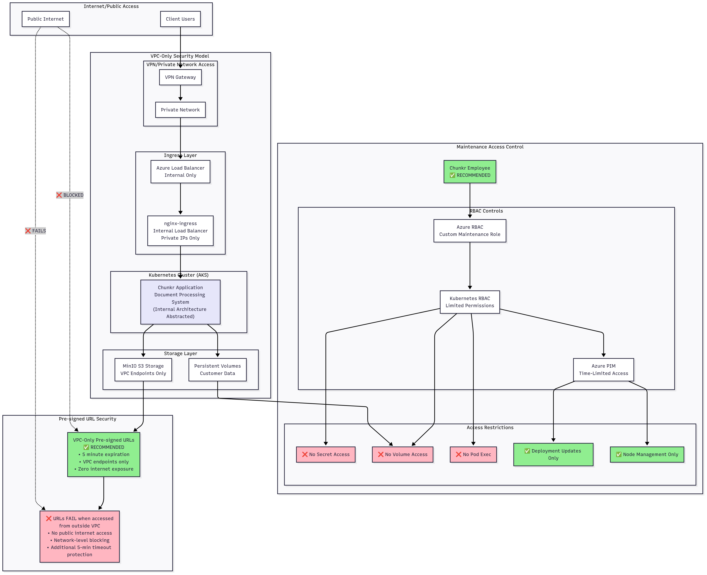

# Chunkr Security Analysis

## Pre-signed URLs

### Overview

Pre-signed URLs are cryptographically signed, time-limited URLs that provide secure access to cloud storage without exposing credentials. They are widely adopted across the industry by companies like Netflix, Dropbox, and GitHub due to their balance of security and usability.

**How they work:**
- Cloud provider (AWS/Azure) generates URLs with embedded cryptographic signatures
- URLs contain proof of authorization without exposing API keys or credentials
- Time-bounded access with built-in expiration prevents indefinite access
- HMAC signatures prevent URL tampering and unauthorized modifications

### Current Implementation: Standard Pre-Signed URLs

**Security features:**
- **Cryptographic security**: HMAC signatures prevent URL tampering
- **No credential exposure**: Eliminates need for API keys in client applications  
- **Time-based expiration**: Typically 5-10 mins prevents indefinite access
- **Audit logging**: Full access tracking through cloud provider logs

**Use case:** Appropriate for public-facing applications where ease of access is prioritized alongside reasonable security measures.

### Enhanced Security Options

#### Option 1: IP Allowlisting (VPC-Adjacent)

**Implementation:**
- Pre-signed URLs restricted to specific IP ranges or CIDR blocks
- Client organizations provide approved IP addresses
- Bucket policies enforce IP-based access control at the cloud level

**Security benefits:**
- **Restricted access perimeter**: URLs only function from known networks
- **Prevents casual sharing**: URLs are useless outside approved IP ranges
- **Configurable scope**: Per-client IP restrictions possible
- **Audit trail**: Access logs show source IPs for security investigation

**Operational considerations:**
- **IP management overhead**: Clients must maintain current IP address lists
- **Remote work challenges**: May require VPN for remote employees
- **Dynamic IP handling**: Regular IP list updates may be needed
- **Multi-region complexity**: Global clients need multiple IP ranges managed

#### Option 2: VPC-Only Access (Maximum Security)

**Implementation:**
- S3/Azure storage configured with VPC endpoints and restrictive bucket policies
- Storage accessible only within private network infrastructure
- Pre-signed URLs fail when accessed from public internet

**Security advantages:**
- **Zero external attack surface**: URLs completely inaccessible from internet
- **Network-level security**: Requires VPC breach for any URL exploitation
- **Defense in depth**: Combined network and application layer security
- **Compliance friendly**: Data never traverses public internet
- **Full functionality**: Web frontend and file access work seamlessly but only within VPC

**Operational requirements:**
- **Network access**: Users must connect via VPN or private network
- **Infrastructure complexity**: Requires VPN setup and user training
- **Access management**: VPN credentials become critical security component

### Azure Blob Storage vs MinIO Storage

Both Azure Blob Storage and MinIO support pre-signed URLs with similar security features. However, given the existing MinIO infrastructure, there are no compelling advantages to switching to Azure Blob Storage.

**Current MinIO setup:**
- Already integrated and operational
- Self-hosted within controlled infrastructure
- VPC-native deployment with no internet exposure required
- Complete control over encryption and security policies
- Full data sovereignty

**Azure Blob Storage considerations:**
- Frontend applications primarily use SAS URLs for direct blob access (other auth methods like access keys/managed identities aren't suitable for client-side use)
- Supports VPC-only access through private endpoints

**Assessment:** No technical advantages justify migrating from the existing MinIO deployment to Azure Blob Storage. The current setup meets all security requirements while maintaining infrastructure control.

## AKS Cluster Maintenance Access Security

### Challenge
Maintenance personnel require cluster access to update images and perform system operations, but must be prevented from accessing customer data stored in workloads or persistent volumes.

### Azure RBAC Solution for Limited Cluster Access

**Implementation Strategy:**
Azure provides granular role-based access control that can separate cluster management from data access through custom roles and Kubernetes RBAC integration.

#### Option 1: Custom Azure RBAC Role (Recommended)

**Create maintenance-specific role with minimal permissions:**
```yaml
# Custom role: "AKS Maintenance Operator"
permissions:
  - Microsoft.ContainerService/managedClusters/read
  - Microsoft.ContainerService/managedClusters/agentPools/read
  - Microsoft.ContainerService/managedClusters/upgradeProfiles/read
  - Microsoft.ContainerService/managedClusters/listClusterUserCredential/action
  - Microsoft.ContainerService/managedClusters/start/action
  - Microsoft.ContainerService/managedClusters/stop/action
```

**Security benefits:**
- **No data plane access**: Cannot access pod logs, secrets, or persistent volumes
- **Limited to cluster operations**: Can only perform infrastructure maintenance
- **Audit trail**: All actions logged through Azure Activity Log
- **Time-limited access**: Can be combined with PIM (Privileged Identity Management)

#### Option 2: Kubernetes RBAC Integration

**Implement role binding for maintenance tasks:**
```yaml
apiVersion: rbac.authorization.k8s.io/v1
kind: ClusterRole
metadata:
  name: maintenance-operator
rules:
- apiGroups: ["apps"]
  resources: ["deployments", "daemonsets"]
  verbs: ["get", "list", "patch", "update"]
- apiGroups: [""]
  resources: ["nodes"]
  verbs: ["get", "list", "cordon", "uncordon"]
# Explicitly exclude secrets, configmaps, persistent volumes
```
- Limited access to deployments and daemonsets for image updates
- Node management permissions for cordoning during maintenance
- Read-only access to cluster resources for troubleshooting
- Explicitly excludes secrets, configmaps, and persistent volumes
- No access to pod execution or container file systems

**Access restrictions:**
- **No secret access**: Cannot read application secrets or configuration
- **No volume access**: Cannot mount or access persistent volumes
- **No pod exec**: Cannot execute commands inside running containers
- **Limited to system resources**: Only node and deployment management

### Implementation Recommendations

#### For Maximum Data Protection:
1. **Use Azure AD integration** with custom RBAC roles
2. **Enable Kubernetes RBAC** with restrictive role bindings
3. **Implement Pod Security Standards** to prevent privilege escalation
4. **Deploy Network Policies** for workload isolation
5. **Enable audit logging** for all cluster operations - already configured
6. **Use JIT access** through Azure PIM for time-limited permissions

#### Operational Benefits:
- **Separation of concerns**: Clear boundary between infrastructure and data access
- **Compliance ready**: Meets requirements for data access restrictions
- **Audit friendly**: Complete trail of maintenance activities
- **Scalable**: Can be applied to multiple team members with consistent permissions

#### Security Guarantees:
- **No direct data access**: Cannot read application data or secrets
- **No container access**: Cannot execute commands in running workloads  
- **No volume access**: Cannot mount or access persistent storage
- **Limited blast radius**: Compromise of maintenance credentials cannot access customer data

### Current Infrastructure Analysis

- **Private cluster**: Already network-isolated from public internet
- **VNet integration**: Provides network-level security boundaries
- **Bastion/Jumpbox access**: Secure access pattern already established
- **Microsoft Defender**: Monitoring for security threats enabled

**Recommended additions:**
- Configure Azure AD authentication for the cluster
- Implement custom RBAC roles for maintenance personnel
- Enable Kubernetes audit logging
- Deploy Pod Security Standards policies

## Personnel Options for Cluster Maintenance

### Challenge
Determining who should have access to perform cluster maintenance operations while maintaining security boundaries and operational efficiency.

### Option 1: Compliant Chunkr Employee

**Implementation:**
- Designate dedicated Chunkr employee for MGX cluster maintenance
- Employee undergoes comprehensive compliance process
- Minimal permissions granted on top of security training

**Compliance requirements:**
- **Background checks**: Security clearance appropriate for access level
- **Security training**: Specialized training on secure cluster operations
- **Access controls**: Time-limited, audited access with MFA requirements
- **Documentation**: Signed agreements and compliance attestations
- **Regular reviews**: Periodic security training updates and access reviews

**Advantages:**
- **Technical expertise**: Deep understanding of Chunkr infrastructure and architecture
- **Operational continuity**: Consistent maintenance approach across environments
- **Issue resolution speed**: Familiar with system components and troubleshooting
- **Cost efficiency**: No external training overhead for maintenance procedures

**Security considerations:**
- **Insider threat mitigation**: Regular monitoring and audit trail review
- **Access principle**: Least privilege with time-bounded permissions
- **Separation of duties**: Different personnel for different access levels
- **Emergency procedures**: Defined escalation paths for critical issues

### Option 2: Trained MGX Employee

**Implementation:**
- MGX designates employee for cluster maintenance responsibilities
- Chunkr provides comprehensive training on maintenance procedures
- Access limited to specific maintenance tasks with monitoring

**Training requirements:**
- **Technical training**: Kubernetes operations, Azure AKS management
- **Security protocols**: Understanding of data isolation and access boundaries
- **Incident response**: Procedures for handling maintenance issues
- **Compliance requirements**: Understanding of security and audit obligations
- **Ongoing support**: Regular check-ins and knowledge updates

**Advantages:**
- **Internal control**: MGX maintains full control over personnel access
- **Reduced vendor dependency**: Internal capability for routine maintenance
- **Cost predictability**: No ongoing external personnel costs
- **Long-term sustainability**: Knowledge transfer builds internal expertise

**Operational considerations:**
- **Training investment**: Initial time and resource commitment for skill development
- **Knowledge maintenance**: Regular updates as systems evolve
- **Backup coverage**: Need for secondary trained personnel for availability
- **Support requirements**: Ongoing technical support from Chunkr team

## Blackbox Deployment Security

### Overview


### Chunkr Models Running on GPUs Inside Cluster


### OpenAI Model Fine-tuning


## Recommendations



### For Maximum Security

**Recommended Approach:**  
Adopt a VPC-only access model for all storage and services. Enforce strict network policies so that all access occurs exclusively through private endpoints or VPN connections. Ensure that no data ever traverses the public internet.

### Personnel Access

**Recommended Approach:**  
Utilize Chunkr personnel for cluster maintenance with minimal access permissions. Given the implementation of strict RBAC controls that prevent access to customer data, specialized compliance training should be optional rather than required.

**Key Personnel Guidelines:**
- Chunkr employees maintain cluster infrastructure with minimal, time-limited permissions
- Access restricted to deployment updates, node management, and system operations only
- No access to secrets, persistent volumes, or customer data through technical controls
- Optional security training since RBAC implementation prevents data access
- Regular access reviews and audit trail monitoring for all maintenance activities

### Blackbox Deployment

**Recommended Approach:**
Implement comprehensive container-based isolation for all model deployments with encrypted storage, network segmentation, and strict access controls. For OpenAI fine-tuning, ensure all customer data remains within the secure cluster environment with ephemeral training processes and encrypted data pipelines.
