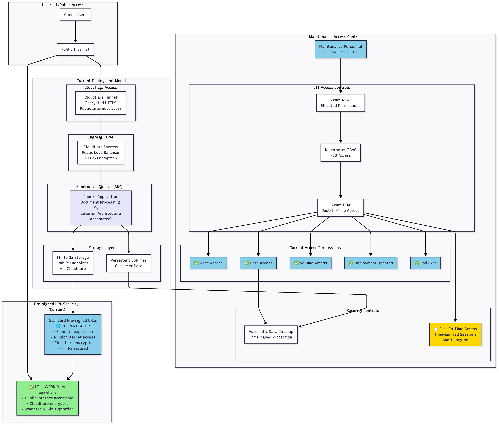

# Chunkr Security Analysis

## Current deployment 



### Current Security Compliance Features

**Network Security & Isolation**
- Private AKS cluster (no public API endpoint)
- Azure Firewall Premium with threat intelligence and intrusion detection
- VNet segmentation with dedicated subnets (AKS, services, endpoints, jumpbox)
- Network Security Groups with restrictive rules
- User-defined routes forcing all traffic through firewall
- Azure Bastion for secure VM access without public IPs

**Identity & Access Controls**
- System-assigned managed identity for AKS cluster
- Azure Key Vault integration with automatic secret rotation
- PostgreSQL with Entra ID authentication enabled
- Jumpbox with Azure bastion access only
- Private container registry (ACR) access
- Keycloak SSO integration with Entra ID for federated authentication

**Security Monitoring & Compliance**
- Microsoft Defender for Containers enabled
- Comprehensive audit logging (API server, audit, controller manager, scheduler)
- Log Analytics workspace for centralized monitoring
- Diagnostic settings capturing all AKS security events

**Data Security**
- PostgreSQL with private networking only (no public access)
- Private DNS zones for internal service resolution
- Customer-managed encryption keys via Key Vault
- Network policies enabled for pod-to-pod communication control

**Infrastructure Hardening**
- Firewall rules allowing only necessary outbound connections
- SSL/TLS termination and inspection capabilities
- Container image scanning in ACR
- Pod Security Standards enforcement ready

## MGX Security Observations on the Current Deployment

MGX's assessment has surfaced three opportunities to raise the security bar:

1) Refine AKS / Kubernetes RBAC – Existing roles work, but tightening them will clearly separate infrastructure duties from any data-plane permissions. Next step: introduce maintenance-only roles without data access in Azure and Kubernetes (see Recommendations).

2) Scope Pre-Signed URLs to the VPC – MinIO links are functional everywhere until they expire; scoping them to VNet endpoints or IP allow-lists will remove even that short-lived external surface. Next step: enforce VNet endpoint policies and optional CIDR/IP allow-lists.

3) Offer an In-VPC Vision-Language Model Option – Inference currently runs on a trusted BAA/ZDR partner (Open AI); some MGX workloads may prefer an on-prem GPU path. 

These observations can be easily implemented, and are explained into the two recommendations below.

## Implementation Plan


### Recommendation — Maximum Security (All In-VPC)

Adopt a VPC-only access model for every storage and compute component. Enforce strict network policies so all traffic flows exclusively through private endpoints or VPN connections—no data ever touches the public Internet. 
These decisions mirror the configuration already deployed at a Fortune 500 chip manufacturer and reflect proven best practices for enterprises requiring full VPC isolation, traceability, and zero public data exposure.

#### Personnel Access

Utilize Chunkr personnel for cluster maintenance under a locked-down RBAC role. Maintainers will have time-boxed access and will have no access to any data - set up through RBAC.

#### Key Personnel Guidelines:

- Chunkr engineers hold minimal, time-boxed permissions  
- Duties limited to deployment updates, node management, and system operations  
- No access to secrets, persistent volumes, or customer data  
- Optional security training since RBAC already enforces isolation  
- Regular access reviews and audit-trail monitoring  

#### Black-Box Deployment

Recommended Approach: Comprehensive container isolation with encrypted volumes, network segmentation, and strict Pod Security Standards.

**Data residency & network:** All Chunkr components—API, workers, MinIO, and GPU-backed Vision-Language Model—run inside your private VPC. Zero egress.

**Model hosting:**  
- **Primary (Full In-VPC):** Self-hosted VLM containers on in-cluster GPUs, auto-scaled via Kubernetes HPA. No external model endpoints.  
- **Alternate (Trusted Provider):** Optionally, inference and fine-tuning can be routed to a foundation-model provider covered by your existing BAA/ZDR. This provider performs all processing via a private, encrypted API with zero data retention. Chunkr orchestrates these calls but does not store data externally.

**Fine-tuning service (optional):** We can optionally finetune compliant endpoint to improve accuracy while honoring BAA/ZDR commitments.

**Signed URLs:** Time-limited (5–10 min), HMAC-signed URLs served from self-hosted MinIO private endpoints (optionally surfaced via Azure Private Link). Links are reachable only inside the VPC, or through explicitly approved CIDR/IP allow-lists enforced by network policies / firewall rules. Objects stay encrypted with customer-managed keys and every access is logged.

**Cluster maintenance:** Least-privilege AKS Maintenance Operator role via Azure PIM — *maintenance-only* (no data-plane access, no secret or volume access)


## Security touchpoints

We based our recommendation on three core decisions: how data is shared, where models are hosted (self-hosted vs. BAA/ZDR provider), and who performs maintenance (Chunkr vs. MGX personnel). Each choice carries trade-offs in auditability, risk surface, and operational complexity.

The following information was taken into consideration to make the recommendations:

## 1. Secure Object Storage

### Challenge
Pre-Signed URLs are accessible via the internet which creates a potential security exposure. Even though the URLs are time-limited and cryptographically signed, they can be accessed from any location with internet connectivity until they expire.

### 1.1 Pre-Signed URLs

Pre-signed URLs offer granular, cryptographically signed, time-limited access to objects without exposing credentials. They are industry-standard (used by Netflix, Dropbox, GitHub) and provide:

* **HMAC-based tamper protection**
* **No credential leakage** to clients
* **TTL-based expiry** (default 5–10 minutes)
* **Full audit logging** via cloud provider

#### VPC-Only Enforcement (Recommended)

* Bucket/Container policies allow access *only* from VPC endpoints.
* **Links resolve *only* inside the VPC; any request from the public Internet is denied even if the URL is leaked, ensuring a zero-exposure attack surface.**
* Optionally layer IP allow-listing for branch offices or VPN CIDRs.

Pre-signed URLs are cryptographically signed, time-limited URLs that provide secure access to cloud storage without exposing credentials. They are widely adopted across the industry by companies like Netflix, Dropbox, and GitHub due to their balance of security and usability.

**Implementation:**
- MinIO/Azure storage configured with VPC endpoints and restrictive bucket policies
- Storage accessible only within private network infrastructure
- Pre-signed URLs fail when accessed from public internet

**Security advantages:**
- **Zero external attack surface**: URLs completely inaccessible from internet
- **Network-level security**: Requires VPC breach for any URL exploitation
- **Defense in depth**: Combined network and application layer security
- **Compliance friendly**: Data never traverses public internet
- **Full functionality**: Web frontend and file access work seamlessly but only within VPC

**Operational requirements:**
- **Network access**: Users must connect via VPN or private network
- **Infrastructure complexity**: Requires VPN setup and user training
- **Access management**: VPN credentials become critical security component

### 1.2 MinIO vs Azure Blob

Self-hosted MinIO already S3-compatible APIs with VPC isolation, customer-controlled encryption keys, and data sovereignty. 

**Current MinIO setup:**
- Already integrated and operational
- Self-hosted within controlled infrastructure
- VPC-native deployment with no internet exposure required
- Complete control over encryption and security policies
- Full data sovereignty

**Azure Blob Storage considerations:**
- Frontend applications primarily use SAS URLs for direct blob access (other auth methods like access keys/managed identities aren't suitable for client-side use)
- Supports VPC-only access through private endpoints

**Assessment:** No technical advantages justify migrating from the existing MinIO deployment to Azure Blob Storage. The current setup meets all security requirements while maintaining infrastructure control.

---

## 2. Model Hosting & Fine-Tuning

### Challenge
Achieving optimal document processing performance while keeping all data within the VPC for maximum security.

### 2.1 Self-Hosted VLM

All Chunkr models, including the vision-language model used for segment processing, can run entirely inside your VPC. Deploying them on your own GPU nodes keeps every document in-cloud, eliminating third-party traffic and preserving strict data privacy.

**Implementation:**
* Chunkr VLM containers deployed on GPU nodes inside the AKS/EKS cluster
* Horizontal Pod Autoscaler adds/removes GPU capacity based on queue depth
* Model instances scale horizontally with Kubernetes for dynamic workload management
* *Data never leaves* the VPC

**Security advantages:**
* Complete data isolation within your infrastructure
* No external API calls or third-party dependencies
* Full control over model inference and processing
* Zero egress traffic for document processing

### 2.2 Provider Fine-Tuning under BAA/ZDR (Recommended)

If you already hold a Business Associate Agreement (BAA) or Zero-Data-Retention (ZDR) contract with a major model vendor, we can fine-tune that provider's foundation model to improve performance over your documents.

**Implementation:**
* Training & inference routed to the provider's private, compliant endpoints
* Data protected by contractual zero-retention and encryption at rest/in transit
* Chunkr orchestrates API calls but does not store data externally

**Use case:** Useful when you want best-in-class foundation model performance while maintaining compliance coverage through existing vendor relationships.

---

## 3. Cluster Maintenance & Access Control

### Challenge
Maintenance personnel require cluster access to update images and perform system operations, but must be prevented from accessing customer data stored in workloads or persistent volumes.

### 3.1 RBAC Design (Recommended)

* **Custom Azure RBAC Role** "AKS Maintenance Operator" with *infrastructure-only* permissions (start/stop, upgrade, node cordon).
* **Kubernetes Role/ClusterRole** excluding Secrets, ConfigMaps, volumes, `exec`, `attach`.
* **Time-limited** grants via Azure PIM; MFA enforced.
* **Audit logs** captured in Azure Activity Log & Kubernetes Audit.

**Implementation Strategy:**
Azure provides granular role-based access control that can separate cluster management from data access through custom roles and Kubernetes RBAC integration.

#### Custom Azure RBAC Role 

**Create maintenance-specific role with minimal permissions:**
```yaml
# Custom role: "AKS Maintenance Operator"
permissions:
  - Microsoft.ContainerService/managedClusters/read
  - Microsoft.ContainerService/managedClusters/agentPools/read
  - Microsoft.ContainerService/managedClusters/upgradeProfiles/read
  - Microsoft.ContainerService/managedClusters/listClusterUserCredential/action
  - Microsoft.ContainerService/managedClusters/start/action
  - Microsoft.ContainerService/managedClusters/stop/action
```

**Security benefits:**
- **No data plane access**: Cannot access pod logs, secrets, or persistent volumes
- **Limited to cluster operations**: Can only perform infrastructure maintenance
- **Audit trail**: All actions logged through Azure Activity Log
- **Time-limited access**: Can be combined with PIM (Privileged Identity Management)

#### Kubernetes RBAC Integration

**Implement role binding for maintenance tasks:**
```yaml
apiVersion: rbac.authorization.k8s.io/v1
kind: ClusterRole
metadata:
  name: maintenance-operator
rules:
- apiGroups: ["apps"]
  resources: ["deployments", "daemonsets"]
  verbs: ["get", "list", "patch", "update"]
- apiGroups: [""]
  resources: ["nodes"]
  verbs: ["get", "list", "cordon", "uncordon"]
# Explicitly exclude secrets, configmaps, persistent volumes
```
- Limited access to deployments and daemonsets for image updates
- Node management permissions for cordoning during maintenance
- Read-only access to cluster resources for troubleshooting
- Explicitly excludes secrets, configmaps, and persistent volumes
- No access to pod execution or container file systems

**Access restrictions:**
- **No secret access**: Cannot read application secrets or configuration
- **No volume access**: Cannot mount or access persistent volumes
- **No pod exec**: Cannot execute commands inside running containers
- **Limited to system resources**: Only node and deployment management

#### For Maximum Data Protection:
1. **Use Azure AD integration** with custom RBAC roles
2. **Enable Kubernetes RBAC** with restrictive role bindings
6. **Use JIT access** through Azure PIM for time-limited permissions

#### Operational Benefits:
- **Separation of concerns**: Clear boundary between infrastructure and data access
- **Compliance ready**: Meets requirements for data access restrictions
- **Audit friendly**: Complete trail of maintenance activities
- **Scalable**: Can be applied to multiple team members with consistent permissions

#### Security Guarantees:
- **No direct data access**: Cannot read application data or secrets
- **No container access**: Cannot execute commands in running workloads  
- **No volume access**: Cannot mount or access persistent storage
- **Limited blast radius**: Compromise of maintenance credentials cannot access customer data

### 3.2 Personnel Options

1. **Chunkr Employee** (recommended): deep system knowledge; least-privilege role ensures no data access.
2. **Customer Employee**: possible with training; same RBAC template.

### Challenge
Determining who should have access to perform cluster maintenance operations while maintaining security boundaries and operational efficiency.

### Option 1: Compliant Chunkr Employee with no data access (recommended)

**Implementation:**
- Designate dedicated Chunkr employee for MGX cluster maintenance
- Employee undergoes comprehensive compliance process
- Minimal permissions granted on top of security training

**Compliance requirements:**
- **Background checks**: Security clearance appropriate for access level
- **Security training**: Specialized training on secure cluster operations
- **Access controls**: Time-limited, audited access with MFA requirements
- **Documentation**: Signed agreements and compliance attestations
- **Regular reviews**: Periodic security training updates and access reviews

**Advantages:**
- **Technical expertise**: Deep understanding of Chunkr infrastructure and architecture
- **Operational continuity**: Consistent maintenance approach across environments
- **Issue resolution speed**: Familiar with system components and troubleshooting
- **Cost efficiency**: No external training overhead for maintenance procedures

**Security considerations:**
- **Insider threat mitigation**: Regular monitoring and audit trail review
- **Access principle**: Least privilege with time-bounded permissions
- **Separation of duties**: Different personnel for different access levels
- **Emergency procedures**: Defined escalation paths for critical issues

### Option 2: Trained MGX Employee

**Implementation:**
- MGX designates employee for cluster maintenance responsibilities
- Chunkr provides comprehensive training on maintenance procedures
- Access limited to specific maintenance tasks with monitoring

**Training requirements:**
- **Technical training**: Kubernetes operations, Azure AKS management
- **Security protocols**: Understanding of data isolation and access boundaries
- **Incident response**: Procedures for handling maintenance issues
- **Compliance requirements**: Understanding of security and audit obligations
- **Ongoing support**: Regular check-ins and knowledge updates

**Advantages:**
- **Internal control**: MGX maintains full control over personnel access
- **Reduced vendor dependency**: Internal capability for routine maintenance
- **Cost predictability**: No ongoing external personnel costs
- **Long-term sustainability**: Knowledge transfer builds internal expertise

**Operational considerations:**
- **Training investment**: Initial time and resource commitment for skill development
- **Knowledge maintenance**: Regular updates as systems evolve
- **Backup coverage**: Need for secondary trained personnel for availability
- **Support requirements**: Ongoing technical support from Chunkr team


## 4. Summary

This architecture is VPC-native by design. All Chunkr services—storage, models, APIs run entirely inside your cloud. No shared tenancy, no external traffic, no public URL exposure. It's hardened for zero egress.

As a result, Chunkr will only be reachable from within the same VNet. Any application consuming Chunkr output, web app, backend, or pipeline, must also be deployed inside that VNet. While this constraint enhances security by ensuring only your internal services can call Chunkr endpoints, it does require all users and services to access Chunkr through the VPC (either by being deployed within it or connecting via VPN/private network connections).

If desired, external model fine-tuning is supported via encrypted channels under BAA/ZDR agreements. But by default, every document, URL, and inference stays local, backed by customer-managed keys, private endpoints, and auditable RBAC. We've delivered this exact airgapped architecture for a Fortune 500 chip manufacturer, and can do the same for MGX. This includes VPC-only reachability, in-cluster model inference, scoped signed URLs, and tightly bound RBAC maintenance roles. Every service—APIs, storage, GPU-backed model containers—runs in your cloud under your control. There are no shared components, no shared tenancy, and no egress to the public Internet unless explicitly required under a trusted contract.

We have deployed completely airgapped architectures before and can support MGX with the same rigor. With this setup, your documents, outputs, and model activations remain locked inside infrastructure you control, completely inaccessible from outside the VPC.


