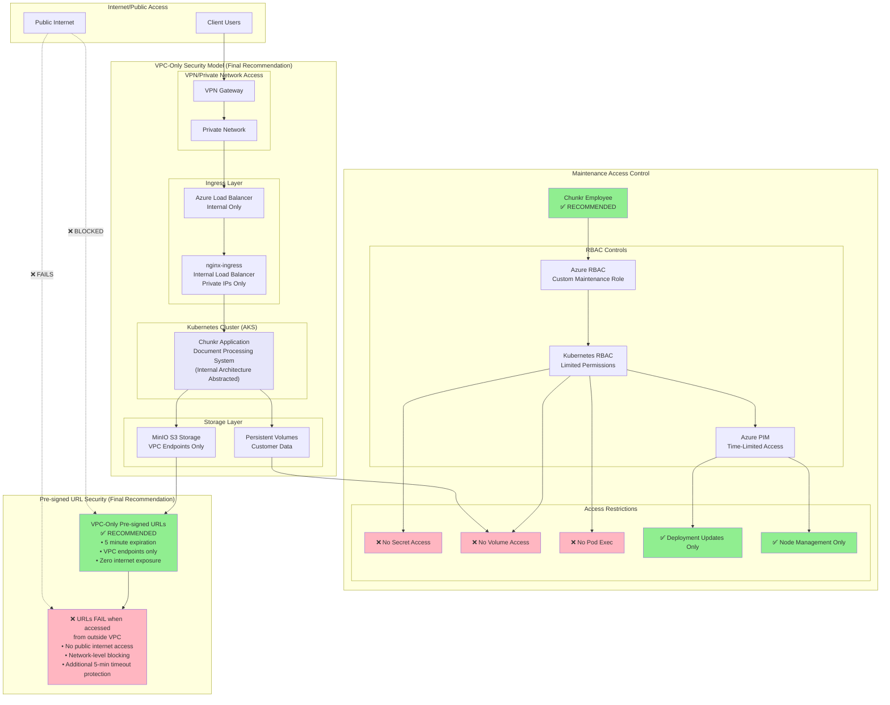

```mermaid
graph TB
    subgraph "Internet/Public Access"
        USERS["Client Users"]
        INTERNET["Public Internet"]
    end
    
    subgraph "VPC-Only Security Model (Final Recommendation)"
        subgraph "VPN/Private Network Access"
            VPN["VPN Gateway"]
            PRIVATE_NET["Private Network"]
        end
        
        subgraph "Kubernetes Cluster (AKS)"
            CHUNKR_BLACKBOX["Chunkr Application<br/>Document Processing System<br/>(Internal Architecture Abstracted)"]
        end
        
        subgraph "Storage Layer"
            MINIO["MinIO S3 Storage<br/>VPC Endpoints Only"]
            VOLUMES["Persistent Volumes<br/>Customer Data"]
        end
        
        subgraph "Ingress Layer"
            NGINX["nginx-ingress<br/>Internal Load Balancer<br/>Private IPs Only"]
            ALB["Azure Load Balancer<br/>Internal Only"]
        end
    end
    
    subgraph "Maintenance Access Control"
        CHUNKR_EMP["Chunkr Employee<br/>✅ RECOMMENDED"]
        
        subgraph "RBAC Controls"
            AZURE_RBAC["Azure RBAC<br/>Custom Maintenance Role"]
            K8S_RBAC["Kubernetes RBAC<br/>Limited Permissions"]
            PIM["Azure PIM<br/>Time-Limited Access"]
        end
        
        subgraph "Access Restrictions"
            NO_SECRETS["❌ No Secret Access"]
            NO_VOLUMES["❌ No Volume Access"]
            NO_EXEC["❌ No Pod Exec"]
            DEPLOY_ONLY["✅ Deployment Updates Only"]
            NODE_MGMT["✅ Node Management Only"]
        end
    end
    
    subgraph "Pre-signed URL Security (Final Recommendation)"
        VPC_ONLY["VPC-Only Pre-signed URLs<br/>✅ RECOMMENDED<br/>• 5 minute expiration<br/>• VPC endpoints only<br/>• Zero internet exposure"]
        
        FAIL_OUTSIDE["❌ URLs FAIL when accessed<br/>from outside VPC<br/>• No public internet access<br/>• Network-level blocking<br/>• Additional 5-min timeout protection"]
    end
    
    %% User Access Flow
    USERS --> VPN
    VPN --> PRIVATE_NET
    PRIVATE_NET --> ALB
    ALB --> NGINX
    NGINX --> CHUNKR_BLACKBOX
    
    %% Internal Service Communication
    CHUNKR_BLACKBOX --> MINIO
    CHUNKR_BLACKBOX --> VOLUMES
    
    %% Maintenance Access (Final Recommendation)
    CHUNKR_EMP --> AZURE_RBAC
    AZURE_RBAC --> K8S_RBAC
    K8S_RBAC --> PIM
    PIM --> DEPLOY_ONLY
    PIM --> NODE_MGMT
    
    %% Security Enforcement
    K8S_RBAC --> NO_SECRETS
    K8S_RBAC --> NO_VOLUMES
    K8S_RBAC --> NO_EXEC
    
    %% Storage Security (Final Recommendation)
    MINIO --> VPC_ONLY
    VPC_ONLY --> FAIL_OUTSIDE
    
    %% Data Flow Security
    VOLUMES --> NO_VOLUMES
    
    %% External Access Failure
    INTERNET -.->|"❌ BLOCKED"| VPC_ONLY
    INTERNET -.->|"❌ FAILS"| FAIL_OUTSIDE
    
    style VPC_ONLY fill:#90EE90
    style CHUNKR_EMP fill:#90EE90
    style NO_SECRETS fill:#FFB6C1
    style NO_VOLUMES fill:#FFB6C1
    style NO_EXEC fill:#FFB6C1
    style DEPLOY_ONLY fill:#90EE90
    style NODE_MGMT fill:#90EE90
    style CHUNKR_BLACKBOX fill:#E6E6FA
    style FAIL_OUTSIDE fill:#FFB6C1
```

Wiki pages you might want to explore:
- [LLM Integration (lumina-ai-inc/chunkr)](/wiki/lumina-ai-inc/chunkr#4.2)
- [Kubernetes Deployment (lumina-ai-inc/chunkr)](/wiki/lumina-ai-inc/chunkr#7.2)