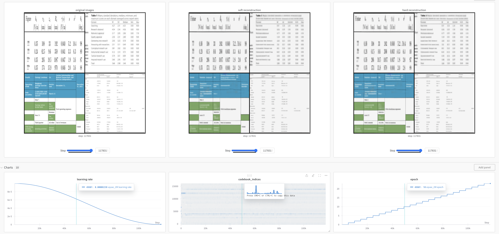

# UniTable: Towards a Unified Table Foundation Model

<p align="center"></p>

1.  📈 [High-Performance Transformers for Table Structure Recognition Need Early Convolutions](https://arxiv.org/abs/2311.05565). ShengYun Peng, Seongmin Lee, Xiaojing Wang, Rajarajeswari Balasubramaniyan, Duen Horng Chau. In *NeurIPS Second Table Representation Learning Workshop*, 2023. (Oral)
2.  🚀 [Self-Supervised Pretraining for Table Structure Recognition Transformer](https://arxiv.org/abs/2402.15578). ShengYun Peng, Seongmin Lee, Xiaojing Wang, Rajarajeswari Balasubramaniyan, Duen Horng Chau. In *AAAI Scientific Document Understanding Workshop*, 2024. (Oral)
3.  🆕 [UniTable: Towards a Unified Framework for Table Structure Recognition via Self-Supervised Pretraining](https://arxiv.org/abs/2403.04822). ShengYun Peng, Seongmin Lee, Xiaojing Wang, Rajarajeswari Balasubramaniyan, Duen Horng Chau. ArXiv, 2024.

Tables convey factual and quantitative data with implicit conventions created by humans that are often challenging for machines to parse. Prior work on table recognition (TR) has mainly centered around complex task-specific combinations of available inputs and tools. We present UniTable, a training framework that unifies training paradigm, training objective, and model architecture of TR.
Its training paradigm combines the simplicity of purely pixel-level inputs with the effectiveness and scalability empowered by self-supervised pretraining (SSP) from diverse unannotated tabular images. Our framework unifies the training of all three TR tasks — extracting table structure, cell content, and cell bounding box (bbox) — into a unified task-agnostic training objective: language modeling. Extensive quantitative and qualitative analyses highlight UniTable’s state-of-the-art (SOTA) performance on four of the largest TR datasets. To promote reproducible research, enhance transparency, and SOTA innovations, we have released the first-of-its-kind [Jupyter Notebook](./notebooks/full_pipeline.ipynb) of the entire inference pipeline, fine-tuned across multiple TR datasets, supporting all three TR tasks.


> This repo includes code for linear projection Transformers. For convolutional stem (early convolution) Transformers, please check out our [tsr-convstem repo](https://github.com/poloclub/tsr-convstem). 

# News
`Apr. 2024` - You can fully digitalize your own tabular image in our [Jupyter Notebook](./notebooks/full_pipeline.ipynb).

`Apr. 2024` - UniTable v1.0.0 is now online with model weights available at [HuggingFace](https://huggingface.co/poloclub/UniTable/tree/main).

`Feb. 2024` - We presented "Self-Supervised Pretraining" paper at AAAI'24.

`Jan. 2024` - "Self-Supervised Pretraining" paper was selected as [oral](https://sites.google.com/view/sdu-aaai24/schedule?authuser=0).

`Dec. 2023` - "Self-Supervised Pretraining" paper was accepted by [AAAI'24 Scientific Document Understanding Workshop](https://sites.google.com/view/sdu-aaai24/schedule?authuser=0).

`Dec. 2023` - We presented "Early Convolutions" paper at [NeurIPS'23](https://x.com/RealAnthonyPeng/status/1735715161476866135?s=20).

`Oct. 2023` - "Early Convolutions" paper was selected as [oral](https://table-representation-learning.github.io/#accepted-papers).

`Oct. 2023` - "Early Convolutions" paper was accepted by [NeurIPS'23 Table Representation Learning Workshop](https://table-representation-learning.github.io/).

# Quick Start
1. Set up virtual environment (unitable) by running `make .done_venv` in your terminal.
2. Download all the model weights from [HuggingFace](https://huggingface.co/poloclub/UniTable/tree/main) by running `make .done_download_weights` in your terminal.
3. Try out our demo [Jupyter Notebook](./notebooks/full_pipeline.ipynb) with your own tabular image! Remember to select "unitable" as your notebook kernel. 

# Training
Our code is driven by [Makefile targets](https://www.gnu.org/software/make/manual/make.html) and configured by [Hydra](https://hydra.cc/docs/intro/). Experiment names are defined as `EXP_<name>` in [CONFIG.mk Sec. Experiments](CONFIG.mk). We have also provided how to launch the make target in the comment above each experiment.
## Dataset annotation format
We provide a tiny portion (20 samples) of PubTabNet as an example for a quick walk through of the training process. The dataset (tabular image and annotation) is available at [dataset/mini_pubtabnet](./dataset/mini_pubtabnet/). The annotation for all images are in [mini_pubtabnet_examples.jsonl](./dataset/mini_pubtabnet/mini_pubtabnet_examples.jsonl). Each line is a `json` object that corresponds to a `png` image with the following structure:

```python
"filename": "tabular image filename inside one of the 'train', 'val', or 'test'",
"split": "One of 'train', 'val', or 'test'",
"html": "table structure, cell content, and cell bbox",
    "cells": "Array with all cell content and bbox",
        "tokens": "Array with the content of the cell",
        "bbox": "The bounding bbox of the cell in [x1, y1, x2, y2] format. Only provided when cell is non-empty.",
    "structure": "Dict with table structure",
        "tokens": "Array with html tags that describe the table structure. '[]' represents non-empty cell",
```

If you want to train on your own dataset, please convert your dataset based on the provided format.
The five datasets we used in the paper are [PubTabNet](https://github.com/ibm-aur-nlp/PubTabNet), [SynthTabNet](https://github.com/IBM/SynthTabNet), [FinTabNet](https://developer.ibm.com/exchanges/data/all/fintabnet/), [ICDAR 2019 B2 Modern](https://github.com/cndplab-founder/ICDAR2019_cTDaR), and [PubTables-1M](https://huggingface.co/datasets/bsmock/pubtables-1m).
After downloading these datasets, please update the `root_dir` for each dataset under [configs/dataset/<name>](./configs/dataset/).

## Tracking your training progress
Please register [Weights & Biases account](https://wandb.ai/site) if you want to visualize training curves and reconstructed tables (for pretraining VQ-VAE only). An example of reconstructed tables by VQ-VAE:

<p align="center"></p>


## Finetuning
We present finetuning on the provided mini-PubTabNet. For more details on cross dataset finetuning, please check [CONFIG.mk](CONFIG.mk).
```bash
# table structure
make experiments/ssp_2m_mini_html_base/.done_finetune

# cell bbox
make experiments/ssp_2m_mini_bbox_base/.done_finetune

# cell content
make experiments/ssp_2m_mini_cell_base/.done_finetune
```

## Pretraining
We present training the VQ-VAE and pretraining the visual encoder on the provided mini-PubTabNet. For more details on cross dataset finetuning, please check [CONFIG.mk](CONFIG.mk).

### VQ-VAE
```bash
make experiments/vqvae_mini/.done_pretrain
```

### SSP visual encoder - Masked tabular image modeling (MTIM)
```bash
make experiments/mtim_mini_base/.done_pretrain
```

## Multi-GPU
The default setting is a single gpu, i.e., `NGPU := 1` in [Makefile](Makefile). To enable multi-GPU, please launch the above command with the following format: `CUDA_VISIBLE_DEVICES=0,1,2,3 make NGPU=4 experiment/<exp name>/.done_<training type>`.

## Citation
```bibtex
@article{peng2024unitable,
  title={UniTable: Towards a Unified Framework for Table Structure Recognition via Self-Supervised Pretraining},
  author={Peng, ShengYun and Lee, Seongmin and Wang, Xiaojing and Balasubramaniyan, Rajarajeswari and Chau, Duen Horng},
  journal={arXiv preprint},
  year={2024}
}

@article{peng2024self,
  title={Self-Supervised Pretraining for Table Structure Recognition Transformer},
  author={Peng, ShengYun and Lee, Seongmin and Wang, Xiaojing and Balasubramaniyan, Rajarajeswari and Chau, Duen Horng},
  journal={arXiv preprint},
  year={2024}
}

@inproceedings{peng2023high,
  title={High-Performance Transformers for Table Structure Recognition Need Early Convolutions},
  author={Peng, Anthony and Lee, Seongmin and Wang, Xiaojing and Balasubramaniyan, Rajarajeswari Raji and Chau, Duen Horng},
  booktitle={NeurIPS 2023 Second Table Representation Learning Workshop},
  year={2023}
}
```
## Contact
If you have any questions, feel free to contact [Anthony Peng](https://shengyun-peng.github.io/) (CS PhD @Georgia Tech).

